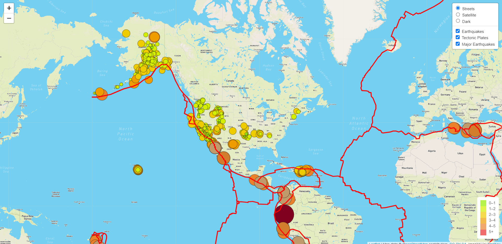
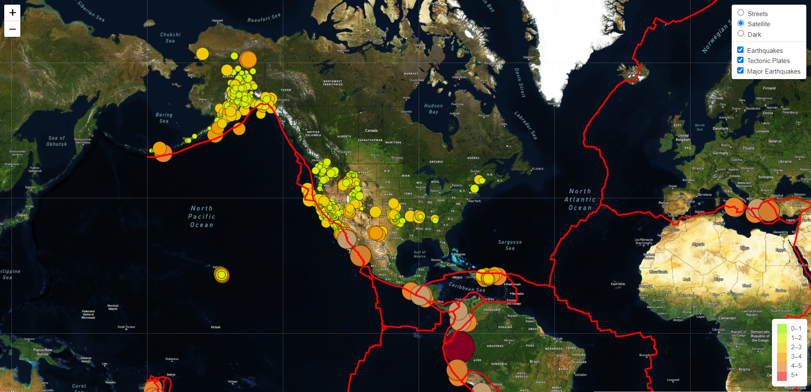
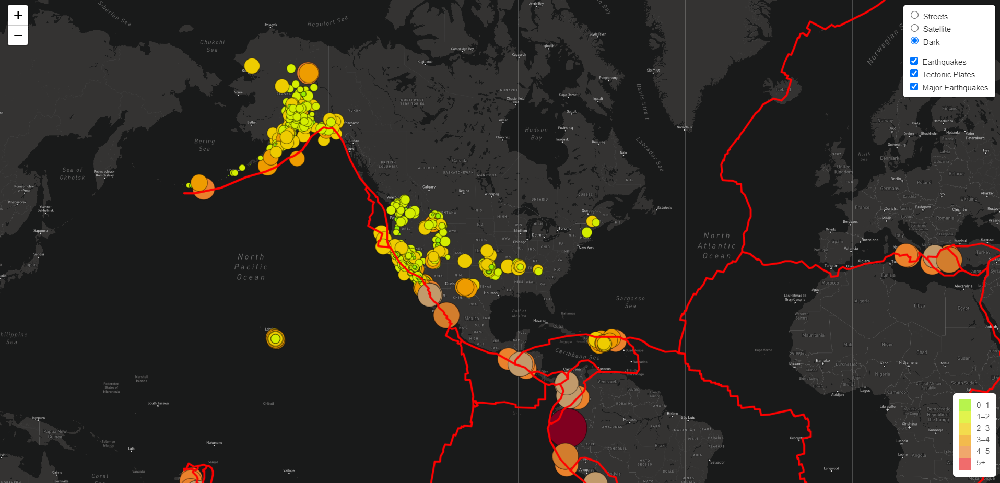

# Mapping_Earthquakes
In this project we explored visualization tools with earthquake data. We created an interactive map that show the different locations and magnitudes of major and minor earthquakes.

## Our website: https://priscillavd77.github.io/Mapping_Earthquakes

Below are pictures of each our map with each of our layers

